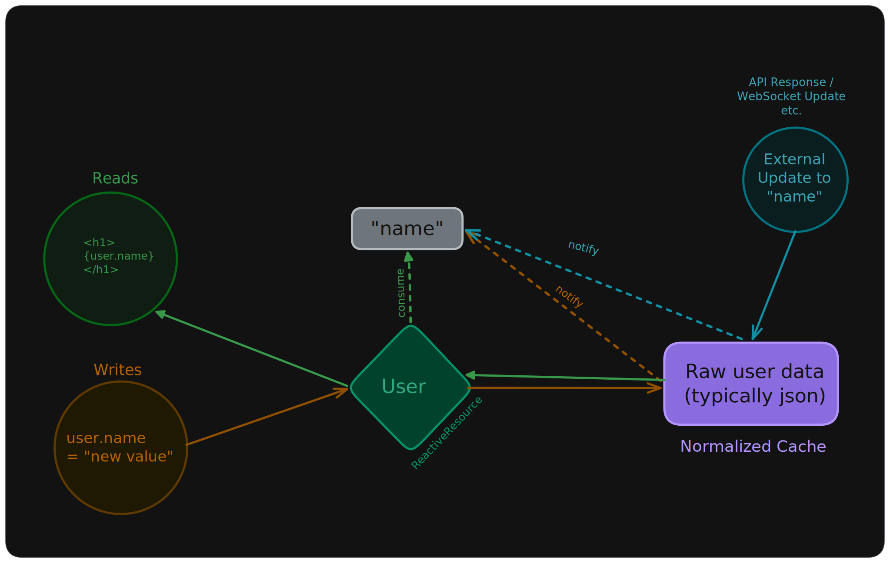
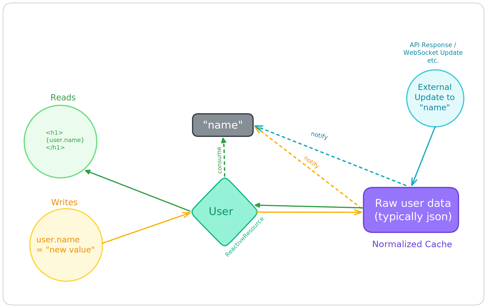

# Reactivity

***Warp*Drive** relies on [signals](https://github.com/tc39/proposal-signals#readme) to enable universal fine-grained reactivity, but where most projects choose a specific signals implementation for consumers to use, ***Warp*Drive** allows you to **bring your own or use your framework's**.

The concept is simple: instead of relying on specifics of signal implementations that may differ, **we use signals purely as just that - a signal**. The signal itself is never responsible for managing state, storage, or value comparisons.

Lightweight hooks translate the basic *create/consume/notify* signal operations into implementation specifics for one (or more) signal libraries.

This enables us to be compatible with even the most lightweight and performant signals implementations. The simplicity of this approach keeps ***Warp*Drive** relatively future-proof should the spec significantly change or fail to advance. Of course, we hope it becomes a first-class feature of both the language and web APIs!

Signals are used to alert the reactive consumers to changes in the underlying cache. E.g. a signal is associated to a value, but does
not serve as the cache for that value directly. We refer to this as
a "gate", though the pattern has also been referred to as "side-signals".

<figure>
  
  
  <figcaption>WarpDrive uses Side Signals</figcaption>
</figure>

We find this approach naturally solves many of the concerns and limitations given around various signals implementations, and fits ***Warp*Drive**'s specific use cases exceedingly well. ***Warp*Drive** manages
normalized caches of raw data - usually json - that are typically asynchronously retrieved from latent sources. By separating signal from storage, we can safely perform cache updates even when multiple asynchronous steps are involved to do so, while only notifying consumers when updates are complete.
